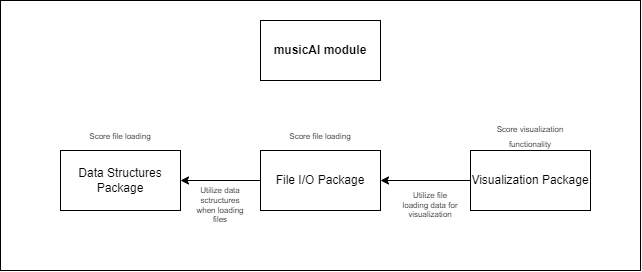

# musicAI

## Music Score Visualization

### Project Motivation
Currently, there exist few, if any, free and open source tools available that display symbolic music notation. 
Most of these existing tools are proprietary and expensive. 
The goal of the project is to create a programmable solution that will enable the visualization of symbolic music in Python, 
drawing the music notation using an existing glyph-based musical font. This project creates a read-only music visualization 
interface that handles MIDI or MusicXML input and displays an interactive musical score in a view window. 
This software is designed for the Soundbendor lab, who need a visualization package to support their research involving 
music and artificial intelligence. This project serves as a foundation for future improvements and functionality. 
This work will allow researchers, or anyone working with MIDI or MusicXML music files, to better visualize, analyze, and 
understand the results of their musical research at a decreased cost.

For in depth design, requirements, and scheduling:
[score-visualization_5.0](musicai/design_docs/score-visualization_5.0.pdf)

### Module Structure


## Quick Start

### Project Dependencies
 - `pyglet`
 - `numpy`
 - `scipy`
 - `python-dotenv`

#### Installing Dependencies

To install dependencies, run `musicai/install.sh`.

### Running the Application

To run the application, run the `musicai/visualization/main.py`.

To load and visualize a score:
```python
file = './example.musicxml'
score = MusicXML.load(file)
window = ScoreWindow(score, WindowConfig())
window.display()
```
**Note**: `WindowConfig()` is an instance of a window configuration file as defined in `visualization/window_config.py`.
An example of default configuration can be seen in `visualization/.msvconfig`. An edited configuration can be passed as 
an argument to the `WindowConfig()` constructor.

### Visualization Features
#### Window and Slicing:
- Scrolling
- Resizing
- Score Information
- Structure Slicing
#### Glyph Placement:
- Staff Lines
- Time Signature
- Clef
- Notes
- Beamed Notes
- Ledger Lines
- Accidentals
- Bar Lines
- Dotted Notes
- Rests
#### In Progress / Next Steps:
- Zooming
- Note Satellites
- Lyrics
- Percussion
- Rest (cont.)
- Dynamic Marks
- Ties / Slurs
- Chords
- Keyboard Parts
- Tuplets
- etc.

## Useful Links
- [Bravura Docs](https://w3c.github.io/smufl/latest/index.html)
- [MusicXML Docs](https://www.w3.org/2021/06/musicxml40/)

## Credits
All credits for this module go to the `Soundbendor Lab` at Oregon State University run by Dr. Patrick Donnelly.
### Contributors
- `Kobe Chenea`
- `Paul Koos`
- `Victor Marquez`
- `Alexander Prestwich`
